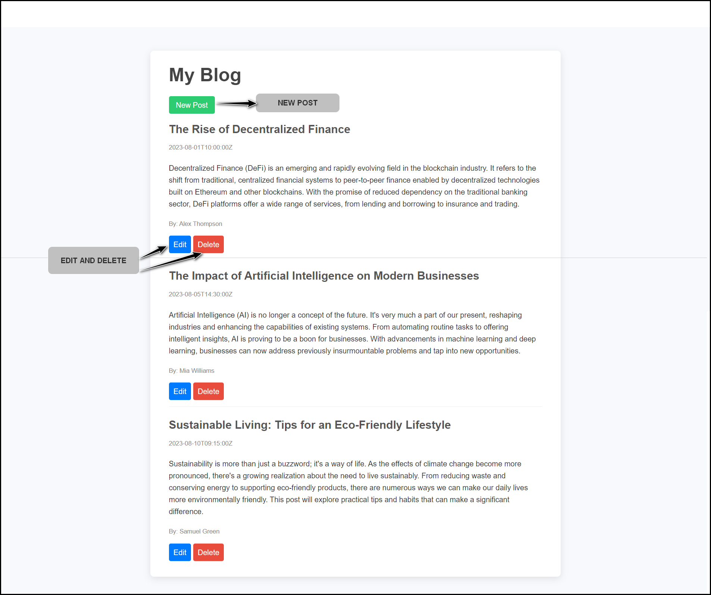

##  Blog

## Overview

The **Blog** is a simple web-based application that allows users to create, edit, and delete blog posts about their experiences. With an intuitive interface, users can easily share their view.

## Features

### Create New Posts

Write and publish  stories using an easy-to-use form.

### Edit Existing Posts

Update any of your previous posts to keep your  stories fresh.

### Delete Posts

Remove any posts that are no longer relevant or desired.

### View All Posts

Display all blog posts in a clean and organized layout for easy navigation.

## Screenshot



## Demo Video

[](./assests/blogs.mp4)

## How It Works

1 **Create a Post**:

- Click the **New Post** button.

- Fill out the title and content in the provided fields.

- Click **Publish** to add your post to the blog.

2. **Edit a Post**:

- Select a post from the list.

- Click the **Edit** button to update your content.

- Make necessary changes and click **Save**.

3. **Delete a Post**:

- Choose a post to remove.

- Click the **Delete** button and confirm the action.

4. **View All Posts**:

- All posts will be listed in chronological order for easy access.

## Technologies Used

- **HTML5**: For structuring the application.

- **CSS3**: For styling the application.

- **JavaScript**: For adding interactivity and managing posts.

- **Node.js**: For the backend server (if applicable).

- **Express**: For handling HTTP requests (if applicable).

## How to Run Locally

1. Clone the repository:

```bash

git clone https://github.com/yourusername/blog.git

```

2. Navigate to the project directory:

```bash

cd blog

```

3. Install the necessary dependencies (if applicable):

```bash

npm install
 
```

4. Start the server:

```bash

npm start

```

5. Open your web browser and go to `http://localhost:3000` (or the appropriate port).

Enjoy sharing your experiences with the **Blog**!
